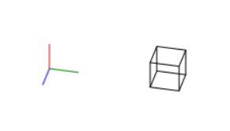
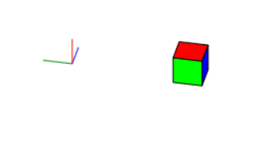
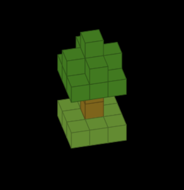
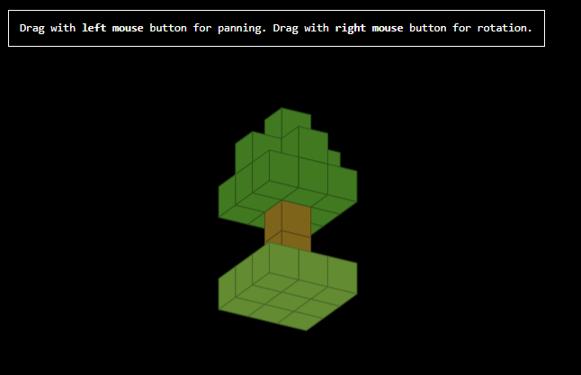
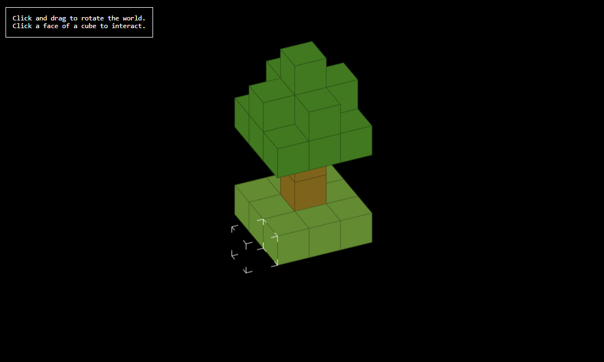

# Block world experiments
Experimenting with rendering a world of blocks in the browser to learn about 3d rendering. Learning by reinventing the wheel.

## 01_transparent_cube
Just drawing lines.  

## 02_solid_cube
Drawing faces, determining face visibility.  

## 03_multiple_cubes
Drawing multiple cubes, depth sorting.  

## 04_camera_control
Pan and rotate the scene.  

## 05_hit_detection
Figuring out a cheap way to detect which cube face the mouse is over.  

## 06_world_interaction
Adding and removing cubes by clicking on cube faces.  

